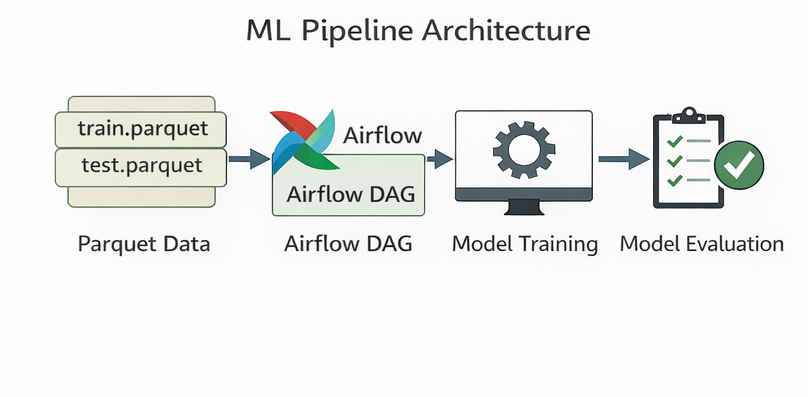

# Airflow ML Training Pipeline - Trip Duration Prediction

This repository contains an end-to-end machine learning training pipeline orchestrated with Apache Airflow.
The pipeline is config-driven, scalable, and reusable across multiple datasets or clients.

The system trains trip duration prediction models using parquet datasets and dynamically generated Airflow DAGs.

---

## High-level pipeline overview


The Airflow DAG orchestrates the full ML workflow from data loading to model evaluation.
Each step is a separate task with explicit dependencies.

At a high level, the pipeline performs:

1. Data ingestion (parquet train/test)
2. Preprocessing and feature preparation
3. Model training
4. Evaluation on a hold-out test set
5. Orchestration, retries, and monitoring via Airflow

---

## Pipeline details

The generated DAG uses the TaskFlow API and runs the following tasks in order:

1. `start` (DummyOperator)
2. `data_quality` (GreatExpectationsOperator)
   - Validates the training dataset with a Great Expectations suite
   - Reads training data from S3 using the Airflow Variable `bucket_name`
3. `train_and_evaluate` (task)
   - Loads train/test parquet files
   - Trains a simple linear regression model using `distance` to predict `trip_duration`
   - Computes RMSE on the test set and returns it via XCom
4. `is_deployable` (BranchPythonOperator)
   - If RMSE < 500, routes to `deploy`
   - Otherwise routes to `notify`
5. `deploy` or `notify` (task)
6. `end` (DummyOperator)

Data paths used by the DAG (per vendor):

- Train: `s3://{bucket_name}/work_zone/data_science_project/datasets/{vendor_name}/train.parquet`
- Test: `s3://{bucket_name}/work_zone/data_science_project/datasets/{vendor_name}/test.parquet`

Note: the threshold and paths are currently hard-coded in the template (`src/templates/template.py`).

---

## Pipeline architecture



The pipeline is modular:

- Parquet datasets as the data source
- Apache Airflow for orchestration
- Python training logic for modeling
- Evaluation results and artifacts produced per run

This separation keeps data, orchestration, and model logic clean and extensible.

---

## Config-driven DAG design

Rather than writing a DAG per dataset, this project uses a template-based, config-driven approach:

- A shared DAG template defines the pipeline logic
- JSON configuration files define dataset-specific parameters
- DAGs are generated dynamically from those configs

Each configuration specifies:

- DAG identifiers and metadata
- Client- or dataset-specific parameters

---

## Project structure

```text
src/
  dags/                  # Generated Airflow DAGs
  templates/             # Reusable DAG templates
    template.py
    generate_dags.py
    dag_configs/         # Per-dataset pipeline configs
data/
  work_zone/             # Parquet datasets
scripts/
  restart_airflow.sh     # Airflow utility script
images/
  Pipeline and DAG diagrams
```

---

## Quick start

1. Add or update a dataset config
   - Create a new JSON file in `src/templates/dag_configs/`
2. Generate DAGs
   - Run the generator script to create DAG files
3. Place the generated DAGs into your Airflow `dags/` folder
4. Start or restart Airflow

Notes:

- The generator reads JSON configs and writes DAGs into `src/dags/`.
- Ensure your parquet datasets exist in `data/work_zone/` (or the path in your config).

---

## Adding a new dataset

1. Copy an existing config in `src/templates/dag_configs/`.
2. Update dataset paths, DAG IDs, and metadata.
3. Re-run the DAG generator.

---

## Configuration reference

Config files live in `src/templates/dag_configs/` and must match `config_*.json`.
Each config is a JSON object with these keys:

- `dag_name`: Airflow DAG ID and output filename in `src/dags/`
- `vendor_name`: Vendor identifier used in dataset paths and notifications

Example:

```json
{
  "dag_name": "model_trip_duration_alitran",
  "vendor_name": "alitran"
}
```

---

## Where to look next

- DAG template: `src/templates/template.py`
- DAG generator: `src/templates/generate_dags.py`
- Example configs: `src/templates/dag_configs/`
- Airflow helper: `scripts/restart_airflow.sh`
